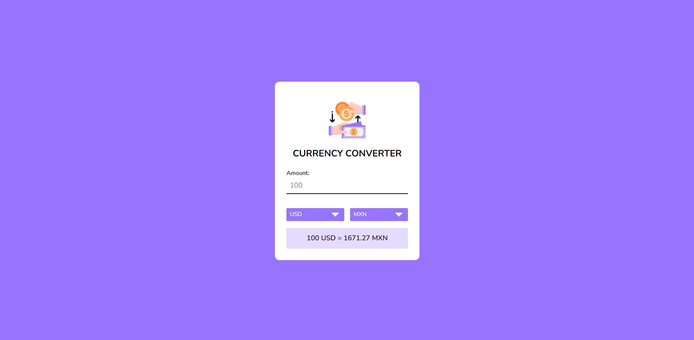

# Currency Converter

Want a quick way to convert currencies? Look no further! This simple web application allows you to convert from one currency to another using exchange rates from <a href="https://www.exchangerate-api.com/" target="_blank">ExchangeRate-API</a>. It has a collection of 170 currencies to choose from. With this web application, you are able to convert currenices in real-time without having to refresh the page. It is also mobile-friendly.

## Features

- **Real-time Currency Conversion**: Convert currencies by typing in the amount and selecting the currency you want to convert from and to from the dropdown menus. The conversion will happen right away and will be displayed at the bottom of the container.
- **Mobile-Friendly**: This web application is mobile-friendly. It will adjust to the size of your screen.
- **170 Currencies**: There are 170 currencies to choose from.

## Core Files

- `index.html`: The HTML file that contains the HTML components for the web application.
- `style.css`: The CSS file that contains the CSS styles for the web application. No media queries are included, but the web application is still mobile-friendly.
- `script.js`: The JavaScript file that contains the functionality for the web application.
- `currency-codes.js`: The JavaScript file that contains the currency codes stored in the drop-down menus.
- `key.js`: The JavaScript file that contains the API key generated from the API to obtain the conversion rates.
- `icon.png`: The icon for the web application.

## How to Run

1. Download the repository.
2. Open the <a href="https://www.exchangerate-api.com/" target="_blank">ExchangeRate-API</a> website and create a free account.
3. Click on the "API Keys" tab on the sidebar and click on the "Add New API Key" button.
4. Copy the key from the website and paste it into `key.js`.
5. Open the `index.html` file in your browser.
6. Type in the amount you want to convert and select the currency you want to convert from and to from the drop-down menus.

## Credits

This project was inspired by the video tutorial <a href="https://youtu.be/ZD_Yft-Qd9Y?si=lKdAkhN8nZhlUKjB" target="_blank">Currency Converter With Javascript | Javascript API Project</a> created by Coding Artist. The real-time currency conversion and improved styling features were added independently. 
